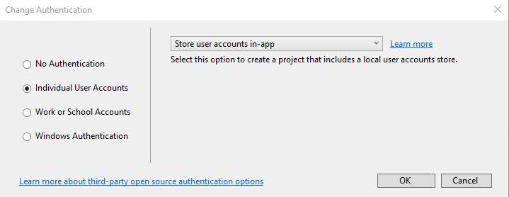
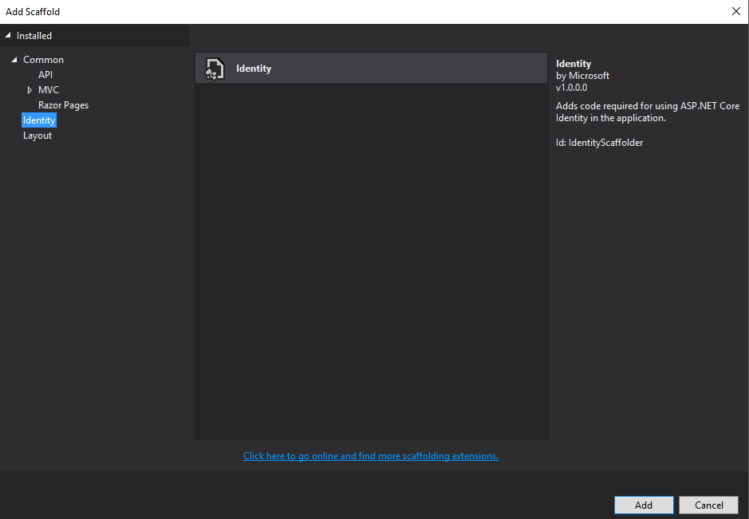
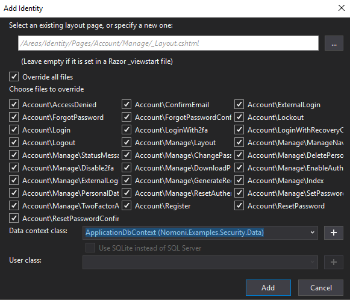

## Prerequisites

To start this tutorial you will need to have completed the first 3 parts in the series:

- [Part 1 : Basic Web App with single module](https://treefish.uk/nomoni/docs/tutorials/part-one-basic-web-app-with-single-module)
- [Part 2 : Adding a Second Module](https://treefish.uk/nomoni/docs/tutorials/part-two-adding-a-second-module)
- [Part 3 : Asset and Navigation Improvements](https://treefish.uk/nomoni/docs/tutorials/part-three-asset-and-nav-improvements)

The result of which is a basic MVC .net core app with a two modules and modular inclusion of javascript and css.

## Outcome

The aim of this tutorial is to add authentication to the solution.

## Step 1 : Replace the original master project

Delete the original master project. Then add a new .net core project to the solution.


**Make sure to change Authentication to "Individual user accounts"**



## Step 2 : Delete the things!

Delete the following folders and content : 

- wwwroot
- Controllers
- Models
- Views

**Make sure to leave the areas folder.**

## Step 3 : Install Nomoni/MVC nuget package

Install the Nomoni.Mvc package in the new master project

```
Install-Package Nomoni.Mvc
```

## Step 4 : Update Startup.cs

Add the Nomoni references to the startup class:              

```
services.UseNomoni();
```

And replace:

```
app.UseMvc(routes =>
{
    routes.MapRoute(
        name: "default",
        template: "{controller=Home}/{action=Index}/{id?}");
});
```
 With : 

```
app.UseNomoni();
```

## Step 5 : Add Module References

Add the module references to the new master project

## Step 6 : Add Authorize Attribute

In the admin model add the Authorize Attribute to the ManagementController

```
    [Authorize]
    public class ManagementController : Controller
    {
       // controller content not shown...
    }
```

## Step 7 : Build and run the new master project

Build and run the new master project, and try to access the management page in the menu...

At this point you will see an error message. The _Layout.cshtml in the main module expects a *BaseViewModel* to be passed to the view. The Login page however in the Razor library that Identity now uses expects a *LoginModel* to be passed to the view.   

In the next few steps we will address this issue.


## Step 8 : Abstract BasePageViewModel to an Interface 

In the shared project create an interface for the BaseViewModel class as follows:

```
    public interface IBasePageViewModel
    {
        IEnumerable<MenuItem> MenuItems { get; set; }
        List<string> PageScripts { get; set; }
        List<string> PageStyles { get; set; }
        string PageTitle { get; set; }
    }

```

Update the expected model for the _Layout.cshtml to the new interface:

```
@model Nomoni.Examples.Basic.Shared.IBasePageViewModel
```

## Step 9 : Update extensions

The *BasePageModelExtensions* class will need updating to work with *IBasePageViewModel*:

```
    public static class BasePageViewModelExtensions
    {

        public static T AddPageScript<T>(this T viewModel, string url) where T : IBasePageViewModel
        {
            viewModel.PageScripts.Add(url);

            return viewModel;
        }

        public static T AddPageStyles<T>(this T viewModel, string url) where T : IBasePageViewModel
        {
            viewModel.PageScripts.Add(url);

            return viewModel;
        }

        public static T PopulateMenu<T>(this T viewModel) where T : IBasePageViewModel
        {
            List<MenuItem> menuItems = new List<MenuItem>();

            foreach (IMenu menu in AssemblyResolution.GetInstances<IMenu>())
                menuItems.AddRange(menu.MenuItems);

            viewModel.MenuItems = menuItems;

            return viewModel;
        }

    }
```

## Step 10 : Add Identity Scaffolding

Right click the new master project then go to 

*Add --> New Scaffolded item... --> Identity*



Check "Override all" and select the Data Context from the dropdown



Click *Add*

This should add all the default identity razor files and associated code to :

*Areas --> Identity --> Pages*

**Note :  If this fails try saving any open files, closing and reopening the solution.**


## Step 11: Add new class for Identity class to inherit from

All the Identity razor pages inherit from *Microsoft.AspNetCore.Mvc.RazorPages.PageModel*

But for _Layout.cshtml they need to inherit from *IBasePageViewModel*

So we need the best of both worlds... 

To do that create a new class in the new master project that looks as follows: 

```

    public class RazorBasePageModel : PageModel, IBasePageViewModel
    {
        public RazorBasePageModel()
        {
            MenuItems = new List<MenuItem>();
            PageScripts = new List<string>();
            PageStyles = new List<string>();
            this.PopulateMenu();
        }

        public IEnumerable<MenuItem> MenuItems { get; set; }
        public List<string> PageScripts { get; set; }
        public List<string> PageStyles { get; set; }
        public string PageTitle { get; set; }
    }

```

## Step 12 : Update all references for PageModel to new RazorBasePageModel

This steps a bit tedious...

All references to *PageModel* in the Identity razor pages code needs updating to *RazorBasePageModel*

Doing a find and replace in *Areas --> Identity --> Pages* is the easiest way to do that.

If you try a build after that it will however fail because the files have not got the namespace for the RazorBasePageModel. Go through each of the files listed as having errors and add the required using statement to remedy that.

To get a page title for the pages to show up the title will need to be set in the constructor of every identity page:

```
    public LoginModel(SignInManager<IdentityUser> signInManager, ILogger<LoginModel> logger)
    {
        _signInManager = signInManager;
        _logger = logger;
        PageTitle = "Login";
    }

```

## Step 13 : One more time!

Build and run the solution and everything should now be working! Huzzah! 

**Note: If you try to register a user it will prompt you to create the database using migrations**

## The Source Code for this Tutorial can be found

[https://github.com/treefishuk/nomoni/tree/master/examples/Nomoni.Examples.Security](https://github.com/treefishuk/nomoni/tree/master/examples/Nomoni.Examples.Security)

## Next Steps

The issue with the current state of things is that EF Core is currently a tightly coupled dependency in the main project. We will fix this in the next tutorial.
