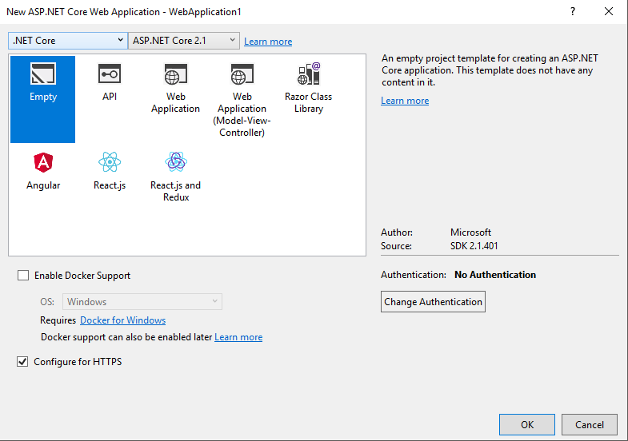
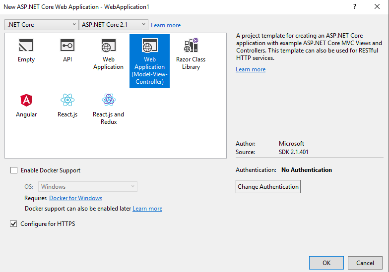

# Getting Started - Part 1 : Basic Web App with single module  

Welcome to part one of the getting started tutorials. This tutorial describes the process of creating a basic web app using Nomoni. The final result will be exactly what you would excpect to see from a default .net core web app template.

## Step 1 : Create empty .net core web application




## Step 2 : Install Nomoni/MVC nuget package

Install the Nomoni.Mvc package in the empty project

```
Install-Package Nomoni.Mvc
```

## Step 3 : Update Startup.cs

```
    public class Startup
    {
        // This method gets called by the runtime. Use this method to add services to the container.
        // For more information on how to configure your application, visit https://go.microsoft.com/fwlink/?LinkID=398940
        public void ConfigureServices(IServiceCollection services)
        {

            services.AddMvc().SetCompatibilityVersion(CompatibilityVersion.Version_2_1);

            services.UseNomoni();
        }

        // This method gets called by the runtime. Use this method to configure the HTTP request pipeline.
        public void Configure(IApplicationBuilder app, IHostingEnvironment env)
        {
            if (env.IsDevelopment())
            {
                app.UseDeveloperExceptionPage();
            }

            app.UseNomoni();

            app.UseStaticFiles();
  
        }
    }
```

## Step 4 : Add a second project using MVC template

This will form the basic of our first module.




## Step 5 : Install Nomoni.Mvc nuget package

Install the Nomoni.Mvc package in the MVC project

```
Install-Package Nomoni.Mvc
```

## Step 6 : Remove Unnecessary Things

Delete : 

- Startup.cs
- appsettings.json

And amend Project.cs to the following:

```
    public class Program
    {
        public static void Main(string[] args)
        {
        }
    }
```

## Step 7 : Update Project .csproj

Update the modules .csproj file to look like this:

```
<Project Sdk="Microsoft.NET.Sdk.Web">

  <PropertyGroup>
    <TargetFramework>netcoreapp2.1</TargetFramework>
    <GenerateEmbeddedFilesManifest>true</GenerateEmbeddedFilesManifest>
  </PropertyGroup>
  
  <ItemGroup>
    <EmbeddedResource Include="Views\**;wwwroot\**" />
  </ItemGroup>

  <ItemGroup>
    <PackageReference Include="Microsoft.AspNetCore.App" />
    <PackageReference Include="Nomoni.Mvc" Version="0.1.18246" />
  </ItemGroup>

</Project>
```

## Step 8 : Create Module Definition

Add a new folder to the module project called "Registrations".

Add a new file called "ModuleInfo.cs" and implement the IModule interface found in Nomoni.Core.Abstractions

```
    public class ModuleInfo : IModule
    {
        public string Name => "Example Module";

        public string Author => "Jon Ryan";
    }
```

## Step 9 : Create Route Registration Definition

Add a new file to "Registrations" called "RouteRegistration.cs" and implement the IRouteRegistration interface found in Nomoni.Mvc.Registration

```
    public class RouteRegistration : IRouteRegistration
    {
        public int Priority => 1000;

        public void Execute(IRouteBuilder routeBuilder)
        {
            routeBuilder.MapRoute(name: "module", template: "{controller}/{action}/{id?}", defaults: new { controller = "Home", action = "Index" });
        }
    }
```

## Step 10 : Launch App

Add the module as a reference in the first project, build and run.

If the steps were successful then you should have a classic ASP .net Core App running


## Source code for this example

The source code for this tutorial can be found here:

[https://github.com/treefishuk/nomoni/tree/master/examples/Nomoni.Examples.Basic](https://github.com/treefishuk/nomoni/tree/master/examples/Nomoni.Examples.Basic)


## Next Steps

In [Part 2 : Adding a second module](/nomoni/docs/tutorials/part-two-adding-a-second-module) we will add a second module to the solution.
